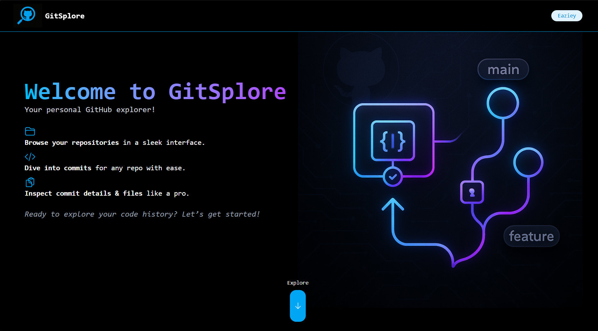
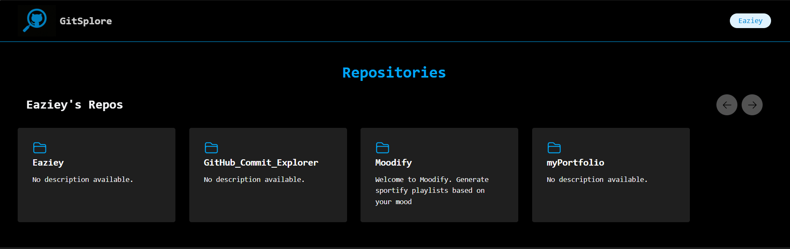
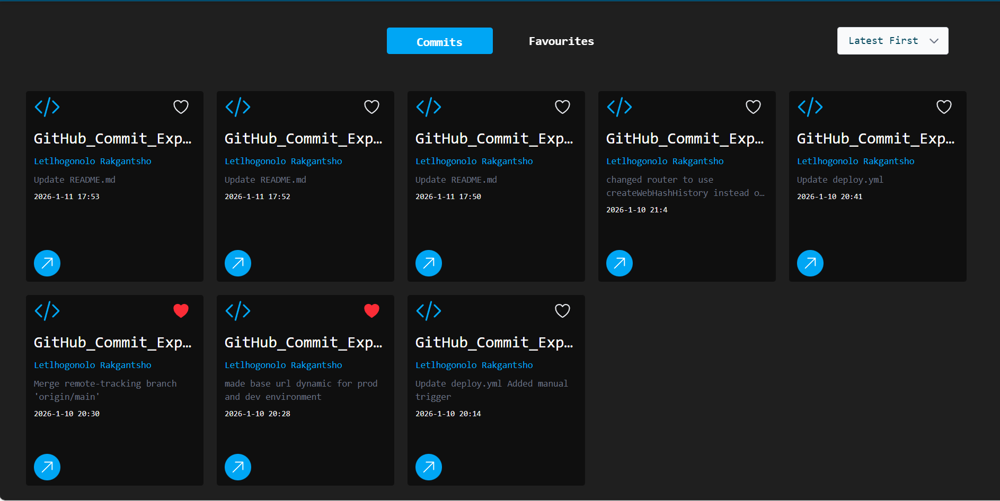
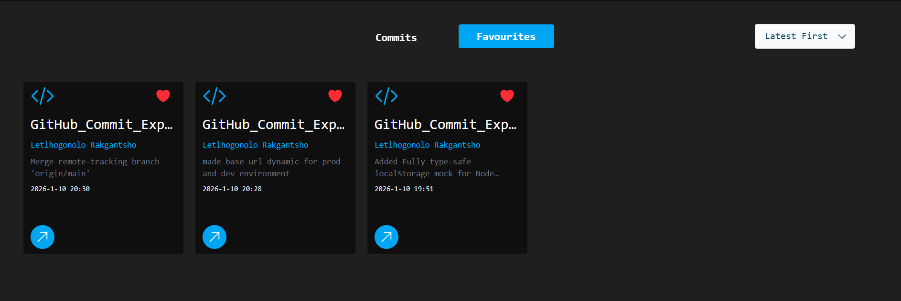
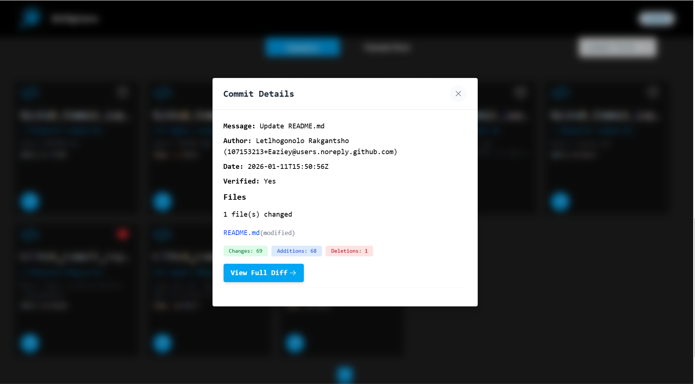
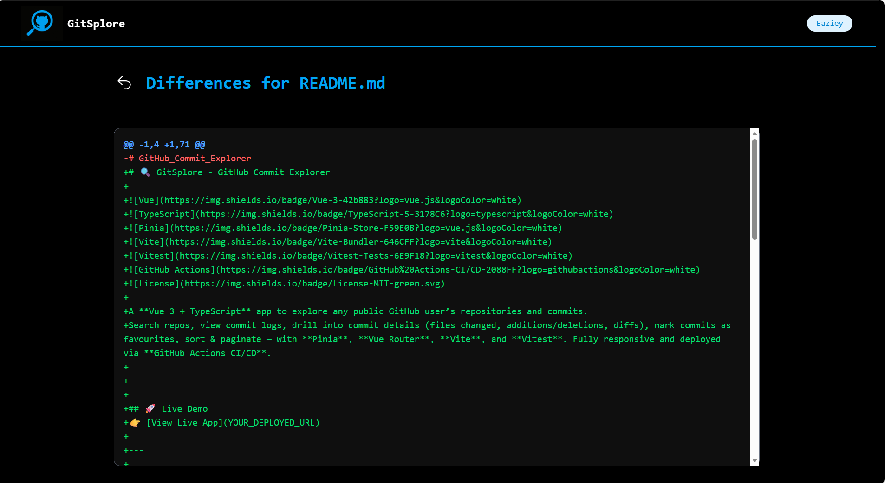

# 🔍 GitSplore - GitHub Commit Explorer


A **Vue 3 + TypeScript** app to explore any public GitHub user’s repositories and commits.  
Search repos, view commit logs, drill into commit details (files changed, additions/deletions, diffs), mark commits as favourites, sort & paginate — with **Pinia**, **Vue Router**, **Vite**, and **Vitest**. Fully responsive and deployed via **GitHub Actions CI/CD**.

---

## 🚀 Live Demo
👉 [View Live App](https://eaziey.github.io/GitHub_Commit_Explorer/)

---

## ✨ Features
- 🔍 **Search GitHub Users** – Enter a username and fetch all public repositories for any github user
- 📜 **View Commits** – Browse commits for any public repository
- 📝 **Commit Details** – See files changed, additions, deletions, and diffs
- ⭐ **Favourites** – Mark commits as favourites and manage them easily
- 🔄 **Sorting** – Sort commits by newest or oldest
- 📑 **Pagination** – Load commits in batches for better performance
- ⚠️ **Error Handling** – Handles invalid usernames, empty repos, and API rate limits
- 📱 **Responsive Design** – Works seamlessly on desktop and mobile
- ✅ **CI/CD** – Automated build and deploy via GitHub Actions

---

## 🛠 Tech Stack
- **Frontend:** Vue 3, TypeScript, Vite
- **State Management:** Pinia
- **Routing:** Vue Router
- **Testing:** Vitest
- **API:** GitHub Open API
- **Deployment:** GitHub Actions

---

## 📸 Quick View
- Home Page
<h3 style="color:#0ea5e9;">Home Page</h3>

-Landing Page
<h3 align="center" style="color:#0ea5e9;">Landing Page</h3>

- Repo Section
<h3 align="center" style="color:#0ea5e9;">Repo Section</h3>

- Commits section
<h3 align="center" style="color:#0ea5e9;">Commits section</h3>
  
-Favourites section
<h3 align="center" style="color:#0ea5e9;">Favourites section</h3>

-View commit modal
<h3 align="center" style="color:#0ea5e9;">View commit details modal</h3>

-Commit Details
<h3 align="center" style="color:#0ea5e9;">Commit differences</h3>


---

## 📦 Installation & Setup
```bash
# Clone the repo
git clone https://github.com/Eaziey/GitHub_Commit_Explorer.git

# Navigate to project folder
cd GitHub_Commit_Explorer/client

# Install dependencies
npm install

# Run development server
npm run dev

# Run tests
npm run test

# Building for Production
npm run build
